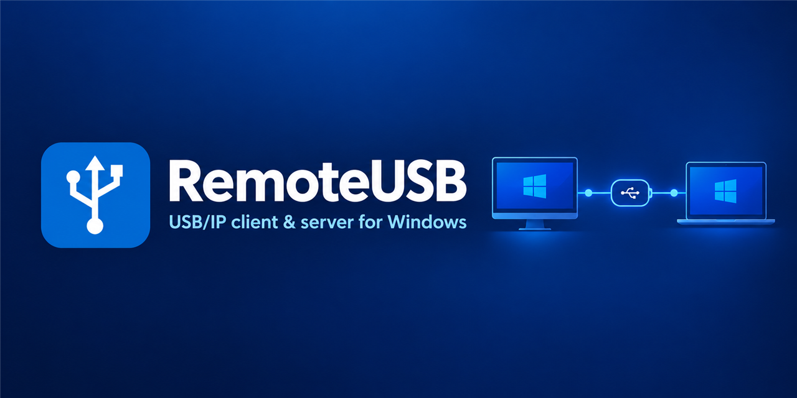
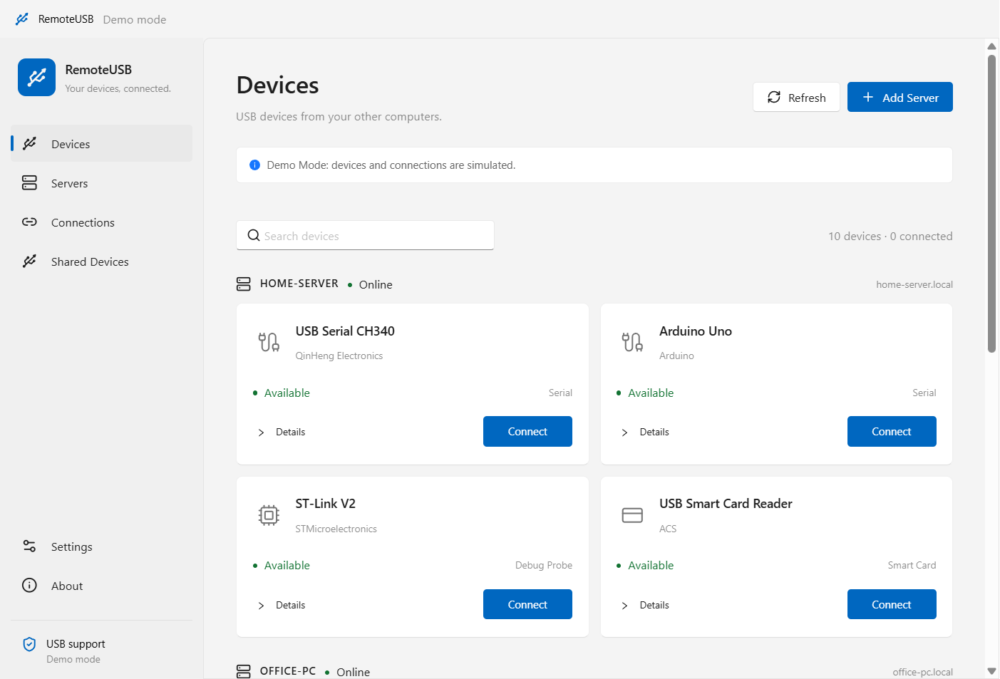
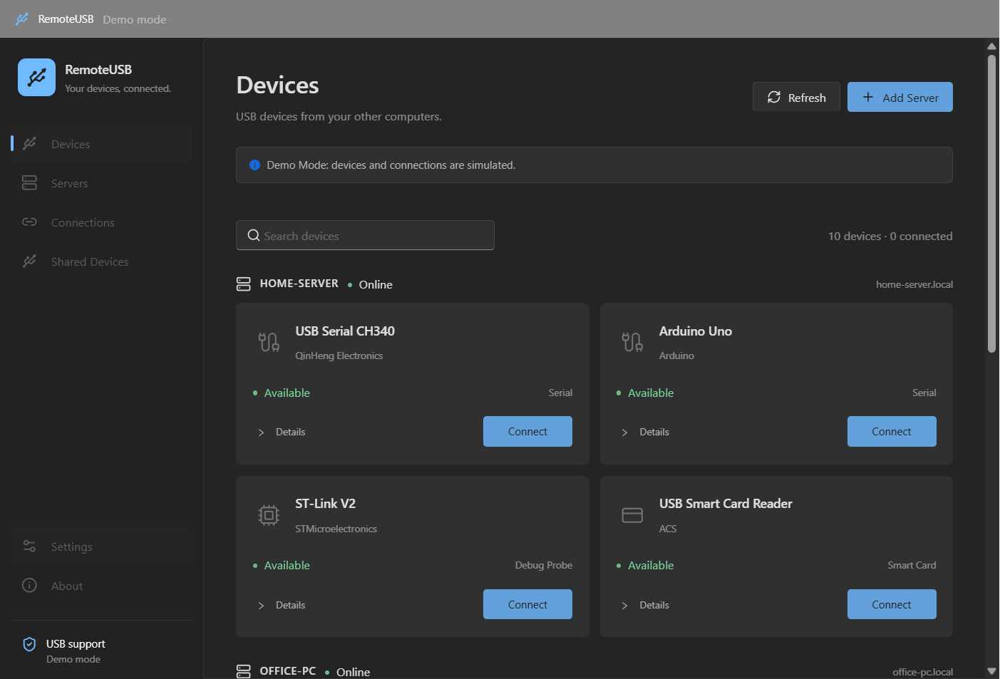

# RemoteUSB



[English](README.md) · [日本語](README.ja.md) · [한국어](README.ko.md) · [简体中文](README.zh-CN.md)

A USB/IP desktop client for Windows with a Windows 11-style interface, built with Electron, React, TypeScript and Ant Design.

RemoteUSB is an MVP. Explore the interface without hardware in Demo Mode, or connect to shared USB devices using the **usbip-win2 0.9.8.0** backend. Real driver installation and USB hardware connections still require manual validation.

## Features

- Device browsing, search, connection status, connect/disconnect and diagnostic details.
- Server creation, editing, removal, enable/disable and connection testing.
- Per-device automatic reconnection with exponential backoff, capped at five minutes.
- English, Japanese, Korean and Simplified Chinese, including the tray and notifications. Select a language or follow the system language.
- Light, dark and system themes; native Mica on Windows 11 build 22621 or later.
- Tray integration, notifications, saved settings, history and window geometry.
- A mock backend for development and demonstrations without drivers.

## Screenshots

Captured from the Electron application using the mock backend.




## Requirements

- Windows 11 x64.
- Development: Node.js 24 LTS and pnpm 10.32.1.
- Real connections: installed usbip-win2 client, its DLLs and drivers, and a separately configured USB/IP server.
- Demo Mode requires no driver, administrator permission or USB hardware.

## Installation

Build the Windows installer from source:

```powershell
pnpm install
pnpm package
```

The NSIS installer is generated at `release/RemoteUSB-Setup-0.1.2.exe`. RemoteUSB release builds are unsigned by default.

The installer bundles the **unmodified official USBip 0.9.8.0 x64 setup**. If selected during installation, RemoteUSB verifies its SHA-256 and Authenticode signature before opening the upstream setup. Follow its administrator permission, component selection and restart prompts. Silent RemoteUSB installations skip USBip setup.

**USBip installation can briefly restart USB hubs and interrupt USB devices. Finish USB storage transfers and calls beforehand.** RemoteUSB does not change Secure Boot or test-signing settings. USBip is installed independently and is not removed when RemoteUSB is uninstalled.

The EXE, installer and tray use the RemoteUSB icon. The installer registers the notification name as RemoteUSB; development runs through Electron may display a different notification source.

## Development and Demo Mode

```powershell
npm.cmd install -g pnpm@10.32.1
pnpm install
pnpm dev:mock
```

Use `pnpm dev` for the real backend. If PowerShell blocks script shims, use `pnpm.cmd` and `npm.cmd`; changing the execution policy is unnecessary.

Demo Mode provides sample serial, Arduino, debug probe, smart card, printer and storage devices. Operations have a simulated 750 ms delay. Adjust the demo error probability in Settings to simulate failures.

Demo settings are stored in `demo.json`, and real settings in `settings.json`. To return to the real backend, restart without `--mock` or `REMOTEUSB_BACKEND=mock`. A built app can also be launched with `pnpm exec electron . --mock`.

## USB/IP setup

1. Run the bundled USBip installer, available through Settings/About or during RemoteUSB installation.
2. Leave the executable path empty to search `Program Files/USBip/usbip.exe`, then `PATH`. For a custom installation, select the absolute path in Settings. Keep the DLLs with the CLI.
3. Share a device on your USB/IP server and add its hostname and port in RemoteUSB; the default is 3240.
4. Test the connection, refresh Devices and select Connect.

usbip-win2 is a **Windows client**, not a server. The old cezanne client, `usbipd.exe` and `attacher.exe` are not bundled. The supported CLI accepts TCP ports 1024–65535.

Run `pnpm vendor:fetch` to reproduce the pinned download and `pnpm vendor:verify` to verify bundled hashes. See the [bundled software guide](vendor/usbip-win2/README.md), [manifest](vendor/usbip-win2/manifest.json) and [backend details](docs/usbip-backend.md) (Japanese).

## Tests and packaging

```powershell
pnpm lint
pnpm typecheck
pnpm test
pnpm build
pnpm test:e2e
pnpm package
```

Unit tests cover parsing, validation, errors, persistence, services, process limits, i18n and React UI. Electron E2E tests use the mock backend to cover server operations, connections, four languages, theme persistence and 125/150/200% scaling. E2E requires a desktop session.

Windows CI runs lint, type checking, tests, build and E2E. These checks do not establish real USB hardware compatibility.

## GitHub Releases

The [Release workflow](.github/workflows/release.yml) supports:

- **Manual execution:** choose Actions → Release → Run workflow, select the branch to release and enter a tag matching `package.json`, such as `v0.1.2`. After successful validation, it creates the tag at the tested commit and publishes the release.
- **Tag push:** push a matching version tag to build and publish that commit.

Releases include the installer, SHA-256 checksums, usbip-win2 source and license. Version mismatches, existing tags pointing to another commit and overwriting an existing release are rejected. Enable GitHub Actions in the repository. Only the publishing job has repository write permission.

## Limitations

- Real driver installation, hardware attach/detach, driver upgrades and removal need testing on the target system.
- Only connections started in the current app session are managed. Port and endpoint matching protects against some port reuse, but external CLI operations and recovery after a crash are not supported.
- COM/PnP matching and kernel-driver signature classification are not implemented.
- Automatic reconnection requires the app to keep running. Start-at-login applies to installed builds.
- Displaying a device category does not guarantee compatibility. Webcam, audio, capture, hub and storage operation is not validated.
- Native notifications, accessibility settings and Mica need verification on target Windows installations.

## Troubleshooting

| Problem                       | Check                                                                               |
| ----------------------------- | ----------------------------------------------------------------------------------- |
| USB support requires setup    | Install USBip; check the CLI path, DLLs and UDE driver.                             |
| Server is offline             | Check the address, port, firewall and device sharing, then refresh.                 |
| Connection fails              | Check use by another PC, physical connections and driver permissions; open Details. |
| Electron reports “bad option” | Remove `ELECTRON_RUN_AS_NODE` from the launch environment.                          |
| Corrupt settings              | The invalid file is preserved as `.invalid-*`; the app starts with defaults.        |

Settings and logs are under Electron's `app.getPath('userData')`. Use `REMOTEUSB_DATA_DIR` for an isolated test directory.

## Architecture and security

- `apps/desktop/src/main`: windows, tray, IPC, services, persistence and logging.
- `apps/desktop/src/preload`: sandboxed bridge.
- `apps/desktop/src/renderer`: React UI.
- `packages/core`, `packages/shared`, `packages/usb-backend`: models, IPC/i18n and real/mock backends.
- `tests`, `scripts`, `vendor`: validation, packaging helpers and bundled software.

See [architecture details](docs/architecture.md) (Japanese). The app enables context isolation and sandboxing, disables Node integration, validates IPC and uses an external-link allowlist. Backend commands use `execFile` without a shell, validated arguments, a default 10-second timeout and a 1 MB output limit. Use USB/IP over a trusted LAN or VPN.

## License

RemoteUSB is [MIT licensed](LICENSE). usbip-win2 is BSD-2-Clause; its copyright, license, unmodified installer and matching source are included. Public development signing keys are omitted from the source copy. Preserve bundled notices when redistributing. See [third-party notices](THIRD_PARTY_NOTICES.md).

## Sharing local USB devices

Open **Shared Devices** to list USB devices connected to this PC and share or stop sharing them using [usbipd-win](https://github.com/dorssel/usbipd-win). The official usbipd-win 5.3.0 MSI is bundled in vendor/usbipd-win. Select the server option on the installer’s USB components page, or open the bundled server tools from Shared Devices. Client and server setup run sequentially; both are selected by default and can be unchecked. RemoteUSB detects it in Program Files or PATH. The page displays Bus ID, VID:PID, sharing state and the connected client, if any.

Share/Stop Sharing opens a centered confirmation dialog and requests administrator permission through Windows UAC for that operation only. Sharing persists after RemoteUSB closes. Stopping sharing may disconnect a remote client. Use a trusted network and configure the usbipd service/firewall appropriately. Demo Mode simulates these operations without changing the machine. Real hardware and UAC interaction require manual verification. See [server implementation notes](docs/usb-server.md).
