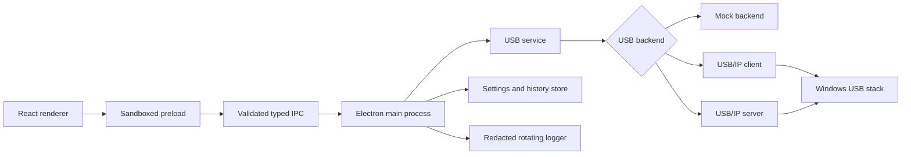
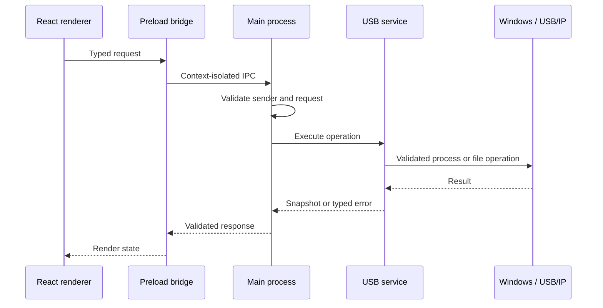
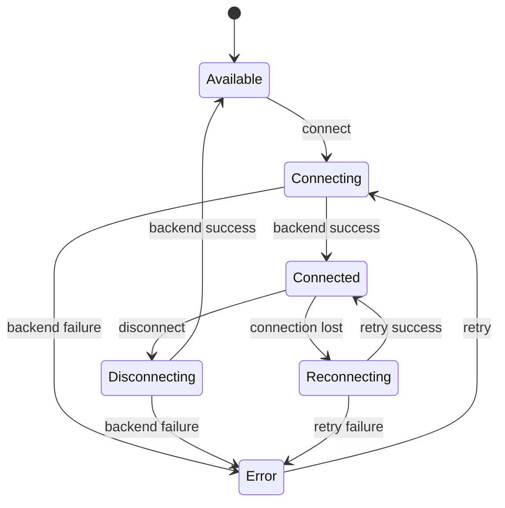

# Architecture

RemoteUSB keeps the renderer separate from Windows process, file and driver operations. The renderer can request typed operations, but only the main process can invoke a backend or access the operating system.

## Request boundary

The main process validates request and response schemas, checks the IPC sender and never exposes arbitrary shell commands. Backend processes use fixed argument arrays, `execFile`, `shell: false`, timeouts and output limits.

## State and persistence

Device operations are serialized per device. Refresh operations are coalesced and do not overwrite an operation already in progress. Settings are schema-validated, written to a temporary file and atomically renamed. Invalid existing data is preserved with an `.invalid-<timestamp>` suffix.

The mock backend uses the same typed boundary and service flow, so Demo Mode does not need USB/IP executables or drivers.
